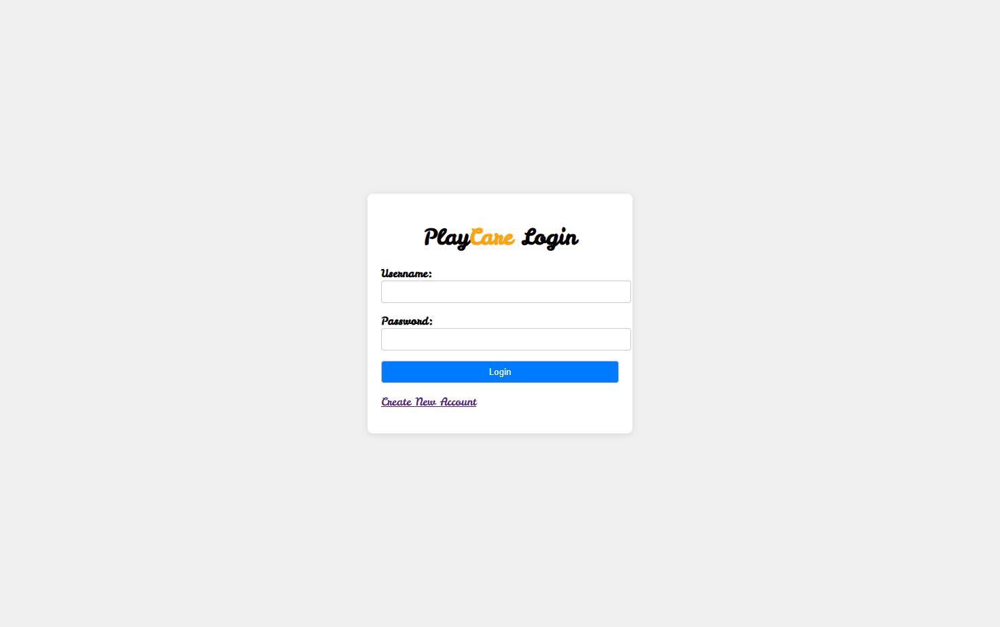
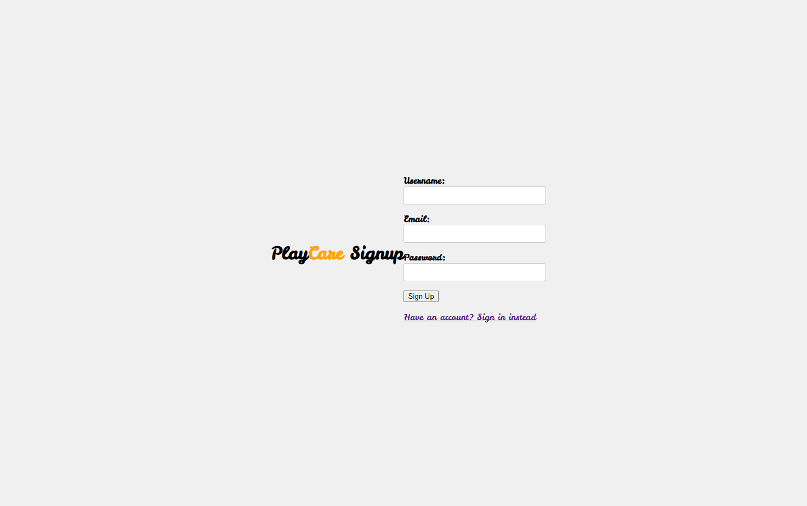
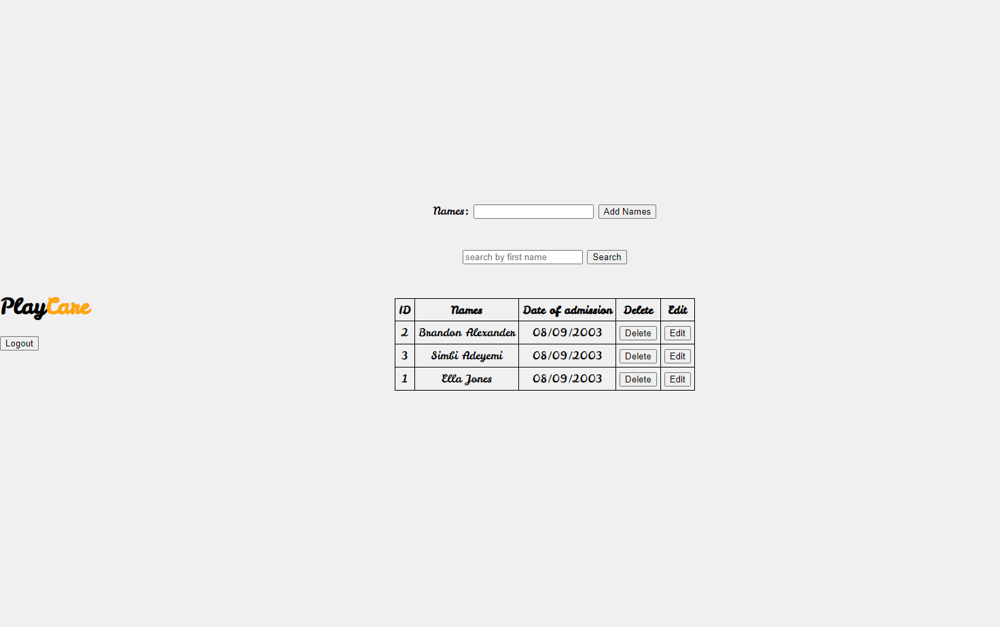

## NAME ##  
Playcare (Interactive Web Application)

## DESCRIPTION ##
* This interactive web application will exhibit intermediate javascript functions as well as utilizing handlebars, and MySQL for a database. 
* This application is intended to be used by daycare employees, so they can access and alter the list of current clients. 

## USAGE ##
* Upon entering the web application, users will have the ability to log in and/or create an account.
* Upon creating an account, employees will have the ability to view, add, and delete children data.

<!-- ## RELEVANT DOCUMENTATION ##
/// All relevant documentation will be listed here. /// -->

## AUTHORS AND ACKNOWLEDGEMENTS ##
* Oyindamola Jongbo
* Brandon Alexander 
* Akash Patel      
* Jonathan Pabon      

